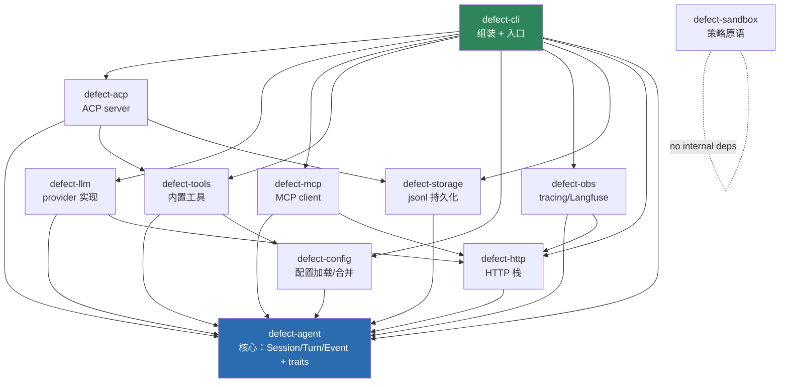
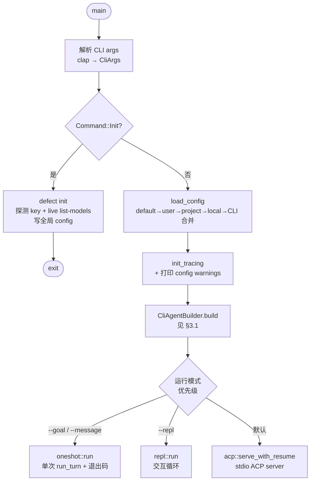
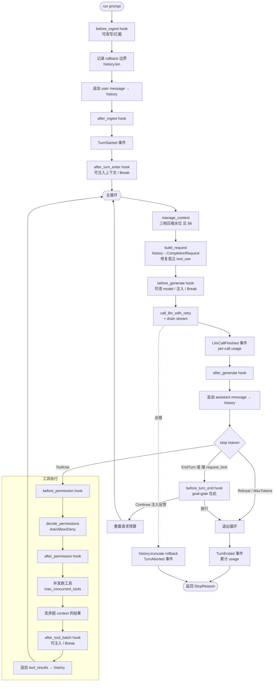
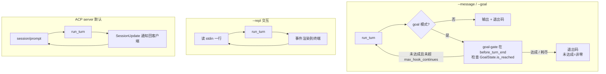
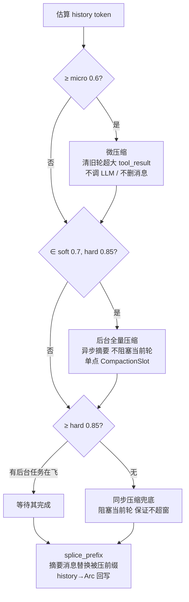
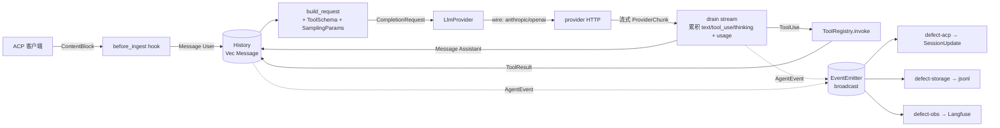
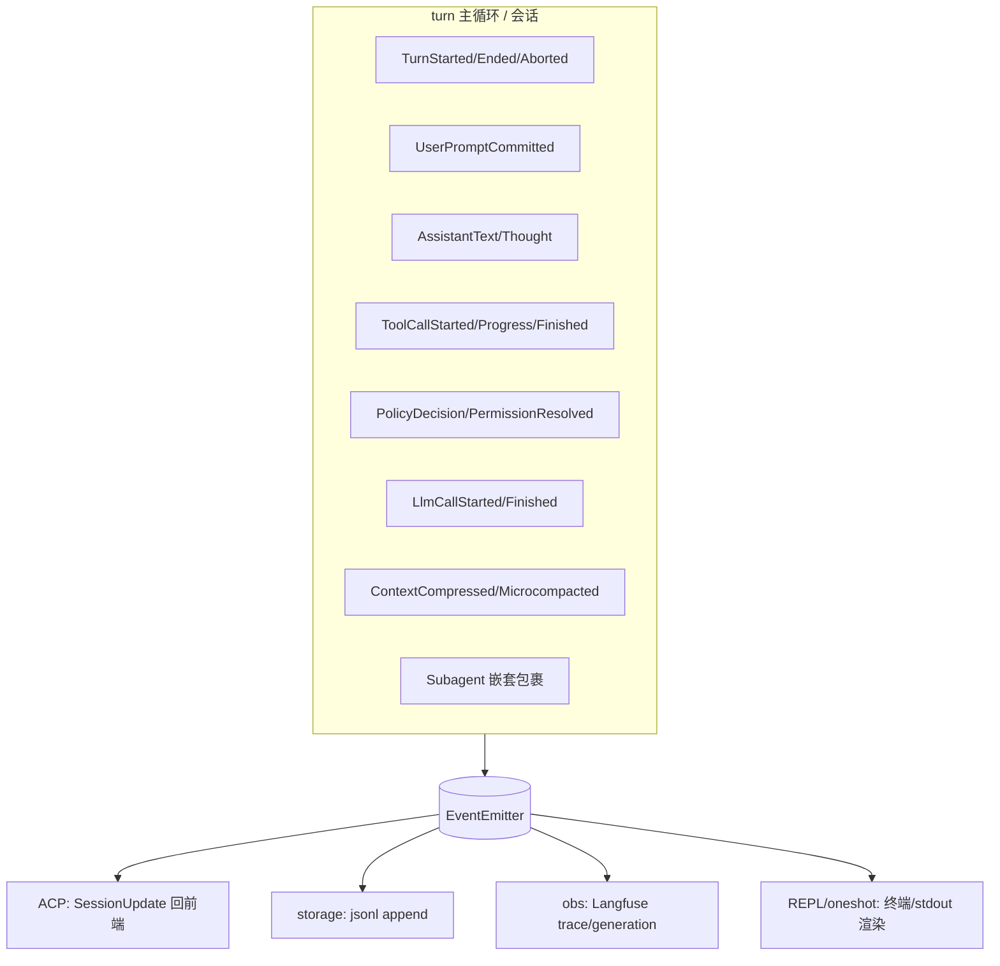
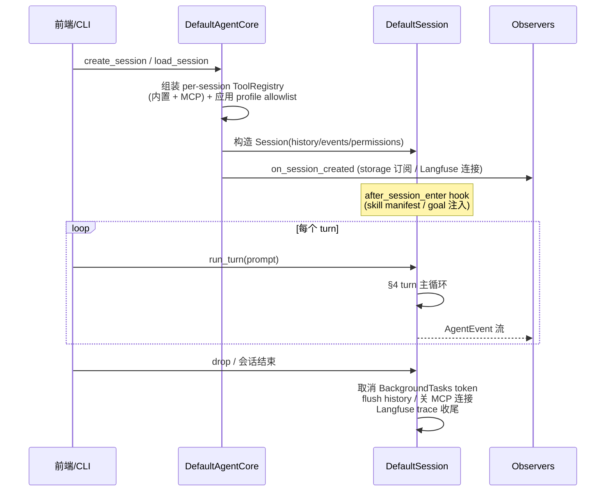

# Defect 架构

Defect 是一个 **headless** 通用编码 agent：自身不提供 UI，前端（Zed 等）通过 **ACP**（Agent Client Protocol）接入，第三方工具通过 **MCP** 接入。本文用流程图梳理整体结构、各循环、数据流向、启停与钩子。

> 配置项的真相源是 `crates/config/src/types.rs`，钩子/事件的真相源是 `crates/agent/src/hooks/step.rs` 与 `crates/agent/src/event.rs`。本文若与代码不符，以代码为准。

---

## 1. 定位与关键决策

| 决策 | 选择 | 理由 |
|---|---|---|
| 对外协议 | Zed 的 ACP | 现成规范，前端直接接入，无需自定义协议 |
| LLM provider | Anthropic Messages + OpenAI-compatible（含 Bedrock/DeepSeek/LiteLLM） | 覆盖主流后端 |
| 工具扩展 | 内置 trait + MCP 双轨 | 内置工具走 crate 内 trait（性能/语义），第三方走 MCP |
| 沙箱 | 策略决策层（read-only / ask-writes / open / deny-all） | OS 级隔离作为未来可插拔后端 |
| 会话持久化 | jsonl append-only，可 resume | 索引化存储留待演进 |

---

## 2. Crate 分层

`defect-agent` 是**核心叶子**：定义 Session/Turn/Event 以及 `LlmProvider`/`Tool`/`HookEngine` 等 trait，**不依赖任何其它 workspace crate**。所有基础设施 crate 反向依赖它（拿到 trait 去实现），`defect-cli` 在最外层把一切组装起来。

依赖方向恒为「**指向 agent**」，保证核心不被基础设施反向污染（例如 config 依赖 agent，而非反过来——配置层复用 agent 的 `TurnConfig` / `BackgroundProgressConfig` 等结构作为真相源）。

---

## 3. 启动流程

入口 `crates/cli/src/bin/cli.rs::main`。`defect init` 子命令走单独的配置生成路径后退出；正常启动按下图组装并路由到一个运行模式。

### 3.1 Agent 组装（CliAgentBuilder.build）

```mermaid
flowchart LR
    subgraph build[CliAgentBuilder.build]
      direction TB
      prof[发现 profiles / skills<br/>项目层 + 用户层]
      reg[build_registry<br/>provider 注册表 + TurnConfig]
      pt[build_process_tools<br/>bash/fs/fetch/search/spawn_agent]
      pol[解析 sandbox policy]
      hk[build_main_session_engine<br/>hooks + skill + goal-gate]
      st[StorageObserver<br/>jsonl 订阅]
      lf[Langfuse observer]
      mcpf[McpToolFactory<br/>per-session MCP 连接器]
      core[DefaultAgentCore]
      prof --> reg --> pt --> pol --> hk --> st --> lf --> mcpf --> core
    end
    core --> built[BuiltCliAgent<br/>agent + turn_config + sandbox_mode<br/>+ shell_output_max_bytes + goal]
```

`BuiltCliAgent` 携带 `shell_output_max_bytes`（来自 `[tools.bash].output_max_bytes`），三个前端（REPL / oneshot / ACP 本地模式）构造 `LocalShellBackend` 时都用它，避免某条入口静默丢配置。

---

## 4. Turn 主循环（核心）

`crates/agent/src/session/turn.rs::TurnRunner::run`。一个 turn 是一个状态机：注入用户输入 → 反复「压缩检查 → 调 LLM → 跑工具」直到模型自愿结束或撞上限，期间在固定 14 个挂载点触发 hook。

**hook 挂载点全集**（`ALL_EVENT_NAMES`，拼错即硬失败）：`after_session_enter`、`after_turn_enter`、`before_ingest`、`after_ingest`、`before_compact`、`after_compact`、`before_generate`、`after_generate`、`before_permission`、`after_permission`、`before_tool_apply`、`after_tool_apply`、`after_tool_batch`、`before_turn_end`。全部**同步**串行触发；单个 handler 超时/panic/出错按降级表跳过（默认超时 5s，可按 hook 配 `timeout_sec`）。

---

## 5. 会话驱动与三种循环

`DefaultSession::run_turn` 用 `turn_lock` 保证单会话同一时刻只跑一个 turn。turn 之间如何续接，取决于模式：

**后台任务续转**：`spawn_agent { run_in_background: true }` 起一个子会话，完成后把 `BackgroundOutcome` 入队；`DefaultSession::run_turn` 在下一轮开始前 drain 队列，把结果作为**前缀块**拼到用户 prompt 前。ACP/REPL 的事件 pump 在任务完成时被 `Notify` 唤醒，可主动起一轮自治 turn 处理结果。

---

## 6. 三档上下文压缩

水位都按模型 `context_window` 的比例推导（Bedrock 等不暴露 window 的 provider 需在 `[providers.x.models]` 显式声明 `context_window`，否则压缩无从触发）。在主循环每次调 LLM 前的 `manage_context` 统一编排：

约束（启动校验，违反硬失败）：每个 ratio ∈ (0,1]，且 `micro ≤ soft < hard`。三档各自有独立开关。

---

## 7. 数据流：一条消息的旅程

跨边界的关键类型：`ContentBlock`（ACP 线格式/事件）、`Message`/`MessageContent`（agent 内部历史）、`CompletionRequest`/`ProviderChunk`（provider 协议面）。`defect-llm` 内的 wire 层（toac 代码生成 + quirk strip 补丁）负责 agent 类型 ↔ 各家 vendor JSON 的互转。

---

## 8. 事件系统

`crates/agent/src/event.rs::AgentEvent`，由 `EventEmitter` 广播，多订阅者各自消费、互不阻塞。

`Subagent` 事件用 `ancestor_path` 扁平化携带子 agent 层级，Langfuse projector 据此重建 trace→step→(llm_call+tools) 分层。

---

## 9. 生命周期：启停与钩子

**启停要点**：MCP 连接是 per-session、由 ToolRegistry 持有，会话 drop 时关闭；后台任务挂在会话级 `CancellationToken` 下，会话结束统一取消；`--local` 模式锚到 repo-root/.defect 并完全忽略用户层。
