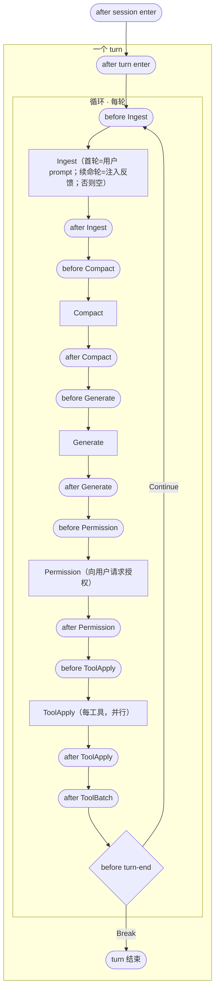

# 提案：同步 Hook 的统一控制模型

> 状态：**已定稿，待落地**。
> 相关：`docs/internal/hooks.md`（现行设计，分类待按本提案更新）、`docs/internal/turn-loop.md`。

## 1. 动机

一个真实需求戳破了现有设计：**turn 即将结束时，判断某条件是否达成（如测试是否跑过）；
未达成就把"还差什么"反馈给 LLM，不让它停、继续干。**

这要求 hook 能**改变主循环走向**——而现状 `hooks.md` §1.1 把"turn 结束"归进了**异步观察**桶
（"只能看"）。分类错了。顺这条线查下去，发现现有 hook 在控制力上有系统性缺口：能改输入、不能改
走向；能拦工具、不能让 turn 续命。本提案不打补丁，而是给 hook 一个**统一模型**。

## 2. 核心模型

一个 turn 剥到底，就是**一条 history 被反复变换，直到不动点**。每轮的结构**完全一致**——
Ingest → Compact → Generate → ToolApply 顺序跑完，到轮尾的 **before turn-end** 判定要不要再来一轮：

下图把 §6 的挂载点（圆角）标在它们所在的流程缝隙上；方块是 history 变换，菱形是轮尾判定。



> ToolApply 是 per-tool 且并行的：`before/after ToolApply` 每个工具各触发一次，整批结束后再触发一次
> `after ToolBatch`。为保持主图清楚，此处把这段并行扇出收成一个节点，细节见 §7。

每轮的每一步都是一次**跨边界调用外部资源**、并落成 history 上的变换：**Ingest** = 摄入一条待处理
输入（用户）；**Generate** = 调 LLM，追加 assistant；**Permission** = 向用户请求授权；**ToolApply**
= 调工具，追加 tool_result。外部资源不止 LLM 和工具——**用户**（Permission 那一步）也是一种外部
资源。每个这样的调用都是 `before → [调用] → after` 三段，hook 挂在前后两个边界上。（Compact 是
纯本地的 history 重写，不调外部资源，是个例外，见下。）

三个要点，正是后面控制模型的地基：

- **Ingest 在循环内，是每轮的输入阶段**——不是 turn 开场的一次性动作。它摄入"这一轮的待处理输入"：
  首轮是用户 prompt，续命轮是 `before turn-end` 注入的反馈，纯推理轮则**空过**（无输入可摄入）。
  这样"用户 prompt"和"续命反馈"是**同一个变换的两次发生**，走同一道 `before/after Ingest` 关——
  续命注入因此自动经过输入守卫钩子，不再是绕过摄入的第二来源。
  > 现状代码 PromptIngest 在循环**外**（`run` 的 `:201`–`:224`，每 turn 一次），续命够不到它。落地
  > 时把摄入挪进循环、并处理"空摄入"。这是实现差异，不是模型该有的样子。
- **ToolApply 无条件发生**，不是分支的一条腿。没有工具要调时，它就是一次**空操作**（空集，什么都
  不 append）——而不是"跳过 ToolApply 直接退出"。所以每轮结构恒定，没有"有工具走这边/没工具走那边"
  的分叉。
- **唯一的控制流分叉点是轮尾的 `before turn-end`**，不在 Generate 之后。"LLM 说 EndTurn" 和
  "没要任何工具" 不是两个出口，而是**两个都流到 before turn-end 的输入条件**。在这一点：默认
  `Break`（结束）；hook 可 `Continue` 续命，注入的反馈成为下一轮 Ingest 的输入（§3 / §6）。
  > 现状代码（`run_inner` 的 `:284` match）拿到 EndTurn 会**提前 return**——那是实现优化，不是模型
  > 该有的样子。本提案按"所有路径汇于轮尾判定"建模，落地时把提前 return 改成流到统一判定点。

一个 hook 的能力压缩成**两条正交的轴**，签名即：

```rust
fn hook<'a>(ctx: &'a mut LoopContext) -> BoxFuture<'a, Option<ControlFlow<TurnEnd>>>
```

**Hook 是异步的。** 主循环 `.await` 它——所以 hook 内部**可以等**：等用户在 ACP 上点确认、等一次
LLM 判断、等子进程跑完。这是现有形态（`fire`/`handle` 已返回 `BoxFuture`）。下文为简洁省略
`BoxFuture` 包装，但每个 hook 都是 async。

**轴一 · 数据 —— `&mut LoopContext`。** Hook 拿到循环的上下文，**改它 = 注入**。ctx 暴露的随
hook 在变换时间线上的位置而定：
- 在某变换**之前**：能改它的**入参**（ToolApply 的 args、Generate 的 request）——这些还没进
  history，是瞬时的变换输入。
- 在某变换**之后**：能读/改它产出的**新 history**（追加反馈、给 tool_result 拼注释）。
- "拦掉一个工具" = 在 ToolApply 之前把该工具的输出在 ctx 里写成"被拒"——是注入的特例，不是单独能力。

**轴二 · 控制流 —— 返回 `Option<ControlFlow<TurnEnd>>`。**
- `None` —— 不干预，按该位置默认走。
- `Break(TurnEnd)` —— 结束 turn（带最终 outcome）。
- `Continue` —— 不结束，回循环顶（`before Ingest`）再转一轮；注入的反馈成为下一轮 Ingest 的输入。

一个 hook 可同时用两轴：**改 ctx 注入反馈 + 返回 `Continue`**，就是 §1 那个"不准停、喂理由继续"。

**位置只决定两件事，不增加能力：**（a）ctx 里有什么可改；（b）`None` 时的默认走向。

这把过去以为的多种能力（block / inject / force-continue）收敛成两轴的组合。现有 `HookOutcome` 的
`block` / `patch` / `append` 三字段被本模型取代，不并存过渡：`patch` / `append` 都是改 ctx，
`block` 则按位置分裂成"注入合成输出"（拦工具）或 `Break`（结束 turn）。

## 3. 一个不变量

**默认走向是 `Break` 的位置（即 before turn-end），其 `Continue` 必须携带注入。** LLM 已说"我说完了"，
若不往 history 注入任何东西就强行续命，下一轮它还会立刻说完 → 死循环。所以"force-continue"在物理上
**必然**是"注入反馈 + Continue"的组合，不存在"空手续命"。

防失控的硬上限（最多续几次）由循环内部计数兜底，不暴露给 hook。

## 4. 注入的角色：统一走 user，并兜底交替

force-continue 的反馈以 **user** 消息进 history——最像"用户又催了一句"，LLM 最易理解"还没完"。

两家 wire codec **都不合并连续同角色消息**（anthropic 编码器是 `messages.iter().map(...)` 1:1
直映，见 `anthropic_messages.rs:60`），而 Anthropic API **强制** user/assistant 严格交替。所以
不能假设"此刻 history 一定以 assistant 结尾"——before turn-end 触发时 assistant 消息是**有条件**才
append 的（`turn.rs:280` 的 `if !assistant.content.is_empty()`），空回复轮可能不以 assistant 结尾。

因此**统一兜底**，不依赖任何位置的巧合：任何注入路径在 append 前检查 history 末尾角色，**末尾已是
user 就并进同一条**（而非新增相邻 user），保证任何注入位置都不产生连续同角色。

## 5. 落到我们的循环

`run_inner`（`turn.rs`）是**唯一**对 hook 有意义的循环。两个内部细节先澄清，免得过度设计：

- **控制流只到 turn 级，没有"杀会话"。** 我们是 ACP server——会话由客户端反复调 `run_turn` 驱动，
  进程内**没有**自持的会话 loop，turn return 后控制权完全交回客户端。会话生命周期的主人是客户端，
  我们无权也无路径单方面终结它。所以 `ControlFlow::Break` 只结束当前 turn。
- **LLM 重试子循环**（`call_llm_with_retry`）是实现细节，不暴露给 hook。
- **续命与压缩的时序**：before turn-end 注入反馈后 `Continue` 回循环顶（`before Ingest`），反馈作为
  本轮输入摄入，随后才是 Compact。压缩保留最新若干轮（tail），注入的反馈是最新的、落在 tail 内，
  不会被压走——安全。

## 6. 挂载点清单

每个挂载点就是一个**边界**：作用域的 `after … enter`（session / turn 已进入之后）、history 变换的
`before | after`（Ingest / Compact / Generate / Permission / ToolApply），以及轮尾的
`before turn-end` 判定。**全部吃同一个签名**（§2）：改 ctx + 返回 `Option<ControlFlow>`。**不分类别**
——能力差异只来自"ctx 在这个位置能看到/改什么"。下表按一次 turn 的时间线列全，「位置」给现状代码的
对应处（`crates/agent/src/session/turn.rs`，session 在 `default.rs`）——但模型与现状有结构差异
（Ingest 入循环、turn enter 前移），故部分位置标"落地调整"。每个点都 emit 一条 `AgentEvent`（供
observe）；「控制」列是该位置上有意义的同步干预，`—` 表示纯 observe。

| 挂载点 | 位置 | ctx 可见 | `None` 默认 | 控制 | 现状 |
| ------ | ---- | -------- | ----------- | ---- | ---- |
| **after session enter** | `default.rs:316` | cwd / new\|resume | 继续 | 注入 system 后缀 / `Break`(拒开 session) | ✅ 仅 append |
| **after turn enter** | turn 起点（摄入前） | history（上轮遗留 / 首轮为空，输入尚未摄入） | 继续 | 注入 / `Break`(拒该 turn) | 落地调整：埋点前移（见下） |
| *（循环顶，每轮）* | `:245` | — | — | — | — |
| **before Ingest** | `:201`（现在循环外） | 可改的待摄入输入（首轮=prompt / 续命轮=注入 / 空） | 继续 | 改写输入 / `Break`(拒该 turn) | ✅ 已实现（待入循环） |
| **after Ingest** | `:215` 后 | 已并入的 history | 继续 | 注入 | 仅 AgentEvent |
| **before Compact** | `:250` | 当前 token 估算 | 继续 | `Break`-to-skip：否决本次压缩 | 需从 observe 迁回 |
| **after Compact** | `:250` 内 | before/after token + 新 history | 继续 | 注入 | 仅 AgentEvent |
| **before Generate** | `:253→:426` | request 快照（从 history 派生） | 继续 | 改 request | 仅 AgentEvent |
| **after Generate** | `:263` | usage / error / 追加的 assistant | 继续 | — | 仅 AgentEvent |
| **before Permission** | `decide_permissions` | 待批工具 + policy 决策 | 继续 | （未来）代答 allow/deny | 仅 AgentEvent |
| **after Permission** | `decide_permissions` 后 | 各工具放行/拒绝结果 | 继续 | — | **缺**（先打桩，能力待定） |
| **before ToolApply** | `:958`（每工具） | tool name / args / safety | 继续 | 改 args / 拦工具(合成输出) | ✅ 已实现 |
| **after ToolApply** | `:989`（每工具） | tool result / error | 继续 | 注入(拼进结果) / `Break` | ⚠️ 仅 append，缺 `Break` |
| **after ToolBatch** | `:313` 后 | 全批 results | 继续 | 注入 / `Break` | **缺**：无 batch 级点 |
| **before turn-end** | 轮尾（`:284` 后，统一判定） | history / stop_reason / 续命次数 | **`Break`** | **注入反馈 + `Continue`** | **缺**（=§1 需求） |

说明：

- **before turn-end 就是 §1 那个需求**，也是唯一默认走向是 `Break` 的点——"什么都不干预"就等于
  "放它停"；hook 返回 `Continue` + 注入就把它按回去再转一轮。它和别的点没有本质不同，只是默认值相反。
  `ControlFlow` 在这里最典型，但不是它专属（任何点都能 `Break`）。
- **before turn-end 只对自愿停止开放续命。** 它是唯一的轮尾判定，但到达它的原因分两类：**自愿**
  （LLM 说 EndTurn、或没要工具空 tool_use——两者流到同一个 before turn-end）和**被动**
  （`Refusal`/`MaxTokens` `:288`/`:291`、`Cancelled` `:246`/`:257`/`:303`、`MaxTurnRequests`
  `:316`）。hook 的 `Continue` 只在自愿停止时生效——被动结束时被忽略，否则 hook 能绕过 request cap
  无限续命。（统一出口 `AgentEvent::TurnEnded` 在 `run:233`，落地时在那里按 reason 区分是否放行
  `Continue`。）
- **before Compact 的"控制"是 skip 开关，不是数据干预。** 压缩是原地重写 history、不产出可注入的
  "输出"（`compact::run` 拿 history snapshot 自洽，见 `compact.rs`）。所以这里 hook 能做的就是
  "否决本次压缩"，语义上是个 `Break`-to-skip 开关，而非改 ctx。
- **after turn enter 在循环（含 Ingest）之外，是 turn 作用域的外括号。** 它标记"turn 已开始、但
  还没进循环、没摄入任何输入"，所以 ctx 里**还看不到本轮输入**（history 是上轮遗留或首轮为空）。它
  独立于 `before Ingest` 存在，不是为了今天——而是因为"进入 turn 作用域"和"摄入第一条输入"是两个
  语义阶段，二者之间的缝**迟早**会塞东西（session 级 skill 加载、turn 初始 system overlay、
  checkpoint 快照……）。把作用域括号焊死在 Ingest 上，等于赌这个缝永远空——不赌。
  > 现状代码 `TurnStarted` 埋在 prompt 落盘**之后**（`:226`），与此模型相反。落地时把 `after turn
  > enter` 的触发前移到循环之前（`:201` 之前）。这是埋点位置的偶然，不是模型该有的样子。
- **before/after Ingest 隔着"history 落盘"分水岭**：`before` ctx 里待摄入输入**可改**、可 `Break`
  拒掉这个 turn；`after` 输入已并入、只能注入。这是旧称 UserPromptSubmit 能改写而 TurnStart 不能的
  实质——但现在它每轮都在，续命反馈和用户 prompt 一视同仁。
- **本提案新增控制力的核心点**：`before Compact`（否决压缩）、`before turn-end`（续命）；**补齐点**：
  `after ToolBatch`、`after ToolApply` 的 `Break`。
- **Permission 是"调用用户"这个外部资源的变换**，所以和别的调用一样有 `before / [Permission] /
  after` 三段（中间那步是向用户发 ACP `requestPermission` 的往返）。v0 两个边界都**仅打桩 observe**、
  不开放控制——policy 仍是放行权威（见 `hooks.md` §7.3）；未来让 hook 代答 allow/deny（`before`）或
  据放行结果干预（`after`）再开。先把桩留好。
- **subagent** 无独立挂载点：`spawn_agent` 工具内嵌套一个完整 turn（复用 `TurnRunner`），父视角是
  before/after ToolApply，子视角是带 subagent 标记的同一套 after turn enter / before turn-end（见 §8）。
- **环境类事件**（CwdChanged / FileChanged / ConfigChange）不在 turn 循环内，是旁路 watcher，
  不属于本模型，v0 不做。

## 7. 并行工具下 `Break` 的语义

工具是并行跑的（`run_tools_concurrently`，`JoinSet`）。`after ToolApply` / `after ToolBatch`
返回 `Break` 时，语义是 **graceful**：不中断已在飞的工具，等这一批 `JoinSet` 自然 join 完，
把所有 tool_result 写进 history，然后在 `:316` 那个判定位置退出 turn——与现有 `MaxTurnRequests`
的退出路径同构。**不做** mid-flight 取消（那是 `cancel` 的职责，语义不同）。

## 8. Subagent

`spawn_agent` 是个工具，其内部跑一个完整的嵌套 turn（复用同一个 `TurnRunner`）：
- 父 agent 视角：它就是 spawn_agent 上的一次 before/after ToolApply。
- 子 agent 视角：它就是带 subagent 标记的同一套 after turn enter / before turn-end hook。

**不需要为 subagent 新增任何挂载点**，靠嵌套 + ctx 上的 subagent 标记即可，handler 按需在 ctx 上
自行过滤。

## 9. 与其他工作的关系

- **异步观察 hook**（`hooks.md` §11）在本模型里不是独立特性——它就是"`None` 永不干预、只读 ctx"
  的退化情形，统一走 AgentEvent 流订阅。两份工作在此合一。
- **before turn-end**（旧称 `TurnEnd`）与 **before Compact**（旧称 `PreCompact`）从异步观察桶迁回
  同步，是本模型的直接结论；分类函数（`is_sync` 等）随之由"该位置是否开放控制流"声明，不再硬编码列表。
- 落地是对现有 `hooks.md` 正文 §1.1 / §2 分类的一次重写，且要迁移现有 5 个 sync hook + 配置解析
  + 测试到新模型——范围不小，单独排期。
